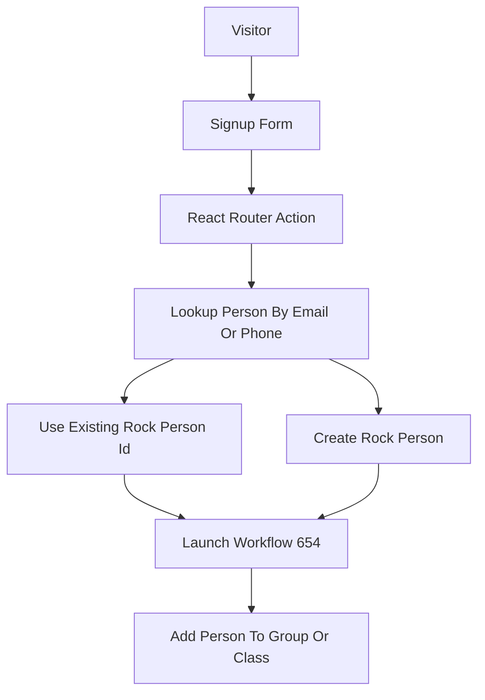

# Finder Signup Form Plan

## Recommended Approach

Use the existing group connect flow as the foundation, but make it ID-driven and reusable for both Groups and Classes.

- Recommended: Refactor the existing modal/form/action to accept a hidden `groupId` from Algolia, then reuse it on group detail pages and class upcoming-session cards. This avoids duplicate Rock workflow logic and removes the fragile current `groupName` to Rock group lookup.
- The single refactored modal is the entry point for both Groups (`app/routes/group-single/...`) and Classes (`app/routes/class-finder/class-single/...`). Do not fork the form per surface.
- Alternative: Build a separate class signup form and action while leaving group signup mostly unchanged. This is faster locally but duplicates person-resolution and workflow behavior.
- Alternative: Use Rock-hosted workflow/form embeds. This avoids custom Rock person logic but gives less control over UI and does not match the requested website-native form.

## Current Code To Reuse

- Existing form UI: [`app/components/modals/group-connect/group-connect-form.component.tsx`](app/components/modals/group-connect/group-connect-form.component.tsx)
- Existing modal flow: [`app/components/modals/group-connect/group-connect-modal.tsx`](app/components/modals/group-connect/group-connect-modal.tsx)
- Existing workflow action: [`app/routes/group-finder/action.tsx`](app/routes/group-finder/action.tsx)
- Existing Rock helpers: [`app/lib/.server/fetch-rock-data.ts`](app/lib/.server/fetch-rock-data.ts), [`app/lib/.server/rock-person.ts`](app/lib/.server/rock-person.ts)
- Group detail CTA surface: [`app/routes/group-single/components/group-single-banner.component.tsx`](app/routes/group-single/components/group-single-banner.component.tsx)
- Class session CTA surface: [`app/routes/class-finder/class-single/components/upcoming-session-card.component.tsx`](app/routes/class-finder/class-single/components/upcoming-session-card.component.tsx)

The important existing behavior is in [`app/routes/group-finder/action.tsx`](app/routes/group-finder/action.tsx): it already resolves a person and launches `Workflows/LaunchWorkflow/0?workflowTypeId=654&workflowName=Add%20To%20Group/Class`. The plan is to keep that Rock workflow contract but change the submitted payload source from `groupName` lookup to direct `groupId`.

## Data Flow

## Implementation Shape

- Create a focused server helper, likely under [`app/lib/.server`](app/lib/.server), for `findOrCreateRockPersonForSignup` and `launchGroupClassSignupWorkflow`. This keeps Rock-specific logic out of route UI files and makes it testable.
- Use `escapeOData` from [`app/lib/.server/rock-utils.ts`](app/lib/.server/rock-utils.ts) for any user-supplied string interpolated into OData `$filter` expressions, and use `TTL.NONE` for all person and phone lookups so signup resolution is real-time.
- When launching workflow `654`, keep the POST body capitalization exactly `{ GroupId, PersonId }`; this casing is load-bearing for Rock.
- Update [`app/routes/group-finder/action.tsx`](app/routes/group-finder/action.tsx) to validate `firstName`, `lastName`, `phoneNumber`, `email`, optional `campus`, and hidden `groupId`; then call the shared helper and return `Response.json()`.
- Update [`app/components/modals/group-connect/group-connect-form.component.tsx`](app/components/modals/group-connect/group-connect-form.component.tsx) to remove birth date and gender, include hidden `groupId`, optionally include campus when supplied, and submit via `useFetcher()` with `{ method: "post", action: "/group-finder" }`.
- Reuse `defaultTextInputStyles` from [`app/primitives/inputs/text-field/text-field.primitive.tsx`](app/primitives/inputs/text-field/text-field.primitive.tsx) for all text inputs; do not restyle them. Use `<SelectInput>` from [`app/primitives/inputs/select-input/select-input.primitive.tsx`](app/primitives/inputs/select-input/select-input.primitive.tsx) for the Campus field.
- On successful form submission, fire `pushFormEvent("form_complete", "group_signup", "Group/Class Signup")` from [`app/lib/gtm`](app/lib/gtm) before calling `onSuccess()`.
- Update [`app/components/modals/group-connect/group-connect-modal.tsx`](app/components/modals/group-connect/group-connect-modal.tsx) and flow props from `groupName` to an ID-first shape like `groupId`, `groupName`, and optional `campus`.
- Update group detail wiring in [`app/routes/group-single/group-single-page.tsx`](app/routes/group-single/group-single-page.tsx) and [`app/routes/group-single/components/group-single-banner.component.tsx`](app/routes/group-single/components/group-single-banner.component.tsx) to pass `hit.objectID` or `hit.id` consistently as the Rock group ID.
- Add a class-session CTA in [`app/routes/class-finder/class-single/components/upcoming-session-card.component.tsx`](app/routes/class-finder/class-single/components/upcoming-session-card.component.tsx), passing `hit.groupId`, `hit.classType`, and `hit.campus` into the same modal.

## Key Assumptions

- For class records, [`ClassHitType.groupId`](app/routes/class-finder/types.ts) is the Rock group/class ID expected by workflow `654`.
- For group records, either `GroupType.objectID` or `GroupType.id` is the Rock group ID. During implementation, verify which value matches the Rock workflow expectation and use one consistently.
- Resolve the `GroupType.objectID` vs `GroupType.id` ambiguity early in implementation by logging a sample Algolia hit and confirming which value Rock workflow `654` accepts as `GroupId`. Standardize on one value and use it consistently in both group-detail and class-session wiring.
- The signup form should use only requested fields: name, phone, email, optional campus, and hidden group ID. No birth date or gender.
- Person lookup should prefer exact email match, then phone match, and should update missing email/phone on existing Rock people without overwriting populated values.
- Verify the correct Rock person field name for campus, likely `PrimaryCampusId`, by inspecting `mapInputFieldsToRock` in [`app/lib/.server/rock-person.ts`](app/lib/.server/rock-person.ts) before passing campus into the `userProfile` array on person create. Do not guess.
- Confirm whether campus comes through as a Rock Campus GUID or numeric Id and match what `mapInputFieldsToRock` expects.

## Validation And Testing

- Add unit tests for the new server helper covering existing person by email, existing person by phone, new person creation, and workflow launch payload `{ PersonId, GroupId }`.
- Add focused component tests for the modal/form to verify it renders requested fields only, includes hidden `groupId`, and handles success/error states.
- Run `pnpm lint` after edits, per project rules. Run targeted `vitest` tests for the helper/form and `pnpm typecheck` if route/action types change.

### Verification Checklist

- Manual trace: with a known existing email, person should resolve via `fetchUserLogin`; with a brand-new email/phone, the create-person path should fire.
- Browser submit on both a Group detail page and a Class upcoming-session card; confirm a `200` from `/group-finder` in the network tab and that workflow `654` appears in Rock with the correct `GroupId` and `PersonId`.
- Confirm the GTM `form_complete` event fires once on success.
- Confirm no `birthDate` or `gender` inputs render and no client-side age gate runs.

## Risks To Check During Implementation

- The existing `group-finder/action.tsx` imports `data` from `react-router-dom`; this should be modernized to `Response.json()` while touching the file.
- Existing `createOrFindSmsLoginUserId` may expect birth date or gender. If it does, the helper should use `createPerson` directly for new unauthenticated records or pass only supported profile fields.
- Phone-number matching currently checks `phoneEntry.personId`, but normalized Rock responses may use `personId` or `PersonId` depending on helper normalization. Tests should lock this down.
- If Algolia group IDs differ from Rock group IDs, the action may need a temporary fallback lookup by `id` or `objectID`; direct ID should remain the primary path.
- The existing `updatePerson` call in [`app/routes/group-finder/action.tsx`](app/routes/group-finder/action.tsx) can overwrite `email` or `phoneNumber` on the matched Rock person. Update this behavior so populated fields are preserved and only missing values are written; call this out explicitly in the helper tests.
