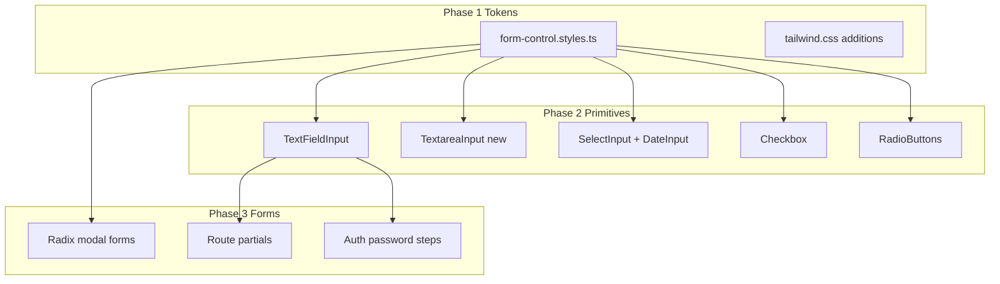

# Form UX Styling Rollout

## Current state

Form controls today are styled inconsistently:

- Three duplicated exports (`defaultTextInputStyles`, `defaultSelectInputStyles`, `defaultDateInputStyles`) in separate primitive files with `rounded-md`, `border-neutral-500`, and `p-2` — not aligned with Figma.
- Figma colors already exist in [`app/styles/colors.ts`](app/styles/colors.ts) and [`app/styles/tailwind.css`](app/styles/tailwind.css) (`gray`/`#F3F5FA`, `dark-navy`, `navy`, `ocean`, `success`, `alert`). Checkbox stroke `#D1D5DB` is not yet a theme token (only used ad hoc in finder filters).
- **Two form patterns:**
  - **Radix Form + native HTML** + style import (~10 modal forms; labels often `text-sm font-bold`)
  - **Controlled primitives** (`TextFieldInput`, `SelectInput`, etc.) in volunteer/Yes/auth early steps
- No textarea primitive; no shared label/helper/error styling module.
- [`Dropdown`](app/primitives/inputs/dropdown/dropdown.primitive.tsx) and [`Slider`](app/primitives/inputs/slider/slider.primitive.tsx) are **out of scope** (finders / non-spec controls).



---

## Phase 1 — Shared form styling tokens

Create [`app/primitives/inputs/form-control.styles.ts`](app/primitives/inputs/form-control.styles.ts) as the single source of truth. Use existing semantic Tailwind tokens where possible; add only what is missing.

### Control surface (text / select / textarea / date)

| Spec                                    | Implementation                                                |
| --------------------------------------- | ------------------------------------------------------------- |
| Height 46px default, 48px focused/error | `box-border h-[46px] focus:h-[48px]` (and error variant)      |
| Radius 10px                             | `rounded-[10px]`                                              |
| Padding 16px / 10px                     | `px-4 py-2.5`                                                 |
| Fill default / focused                  | `bg-gray focus:bg-white`                                      |
| Stroke default                          | `border border-dark-navy/10` (1px)                            |
| Stroke focus                            | `focus:border-2 focus:border-ocean` + focus shadow from Figma |
| Stroke error                            | `border-2 border-alert`                                       |
| Success icon color                      | `text-success` / `colors.success`                             |
| Width                                   | `w-full` (fluid in app)                                       |

Export named constants:

- `formControlBaseStyles` — default field
- `formControlFocusStyles` — composed into base via `focus:` variants
- `formControlErrorStyles` — error shell
- `formControlDisabledStyles`
- `formControlLeadingIconStyles` / `formControlTrailingIconStyles` — padding offsets for icon slots
- `formLabelStyles` — `text-[20px] leading-5 text-dark-navy font-bold` (match Figma label row height)
- `formHelperTextStyles` — `text-base leading-4 text-navy`
- `formErrorMessageStyles` — `text-[20px] leading-5 text-alert flex items-center gap-1.5` (6px icon gap)
- `nativeCheckboxStyles` / `nativeRadioStyles` — for Radix forms still using native inputs inside `Form.Control`

Add to [`app/styles/tailwind.css`](app/styles/tailwind.css) `@theme` if needed:

- `--color-form-stroke-muted: #d1d5db` (checkbox/radio unchecked stroke)
- Optional `--shadow-form-focus` once exact Figma shadow is confirmed from the copied file

**Back-compat:** Re-export `defaultTextInputStyles`, `defaultSelectInputStyles`, `defaultDateInputStyles` from the new module (update primitive files to import from there) so existing import paths keep working during migration.

Use `cn()` from [`app/lib/utils.ts`](app/lib/utils.ts) in primitives when merging state classes.

---

## Phase 2 — Primitive updates

### TextFieldInput ([`text-field.primitive.tsx`](app/primitives/inputs/text-field/text-field.primitive.tsx))

- Replace inline Tailwind with `form-control.styles.ts` exports.
- Apply shared `formLabelStyles` on labels (currently `text-text-primary` without fixed 20px).
- **Icon variants:**
  - Leading icon (email/tel/custom) — reposition for new height/padding
  - Trailing password toggle — new `showPassword` local state when `type='password'`
  - Validated email — new optional `isValidated` prop; show success icon (`Icon` + `colors.success`) on trailing side; do not change validation logic in callers unless they already track validity
- **Error UX:** Replace read-only error input hack with styled error state using `formControlErrorStyles`; keep `setError(null)` on focus behavior. Render error row below field using `formErrorMessageStyles` + error icon (6px gap), not only inline icon inside input.
- Export updated `defaultTextInputStyles` from styles module.

### New TextareaInput ([`app/primitives/inputs/textarea/textarea.primitive.tsx`](app/primitives/inputs/textarea/textarea.primitive.tsx))

- Mirror `TextFieldInput` API minus `type`; reuse same control/label/error/helper styles.
- Min-height instead of fixed 46px (e.g. `min-h-[120px]` or auto rows — keep simple, no layout redesign).
- Add barrel [`textarea/index.ts`](app/primitives/inputs/textarea/index.ts).

### SelectInput + DateInput

- Consume shared base styles; align label typography with text field.
- Fix chevron vertical positioning for new control height (`top` offset).
- Keep native `<select>` / `<input type="date">` — no Dropdown migration.

### Checkbox ([`checkbox.primitive.tsx`](app/primitives/inputs/checkbox/checkbox.primitive.tsx))

- Unchecked: `bg-white border-2 border-[form-stroke-muted]` (or new token), `rounded-[4px]`, `size-5`
- Checked: `bg-ocean border-2 border-ocean`
- Add props: `disabled?: boolean`, `error?: boolean`, `id?: string` (for Radix `htmlFor` compatibility)
- Disabled selected: muted ocean fill/stroke + muted label (`text-neutral-default` or Figma muted ocean classes)
- Default label gap: `gap-2` (8px) on group wrapper; export `formCheckboxGroupStyles` with `gap-2`

### RadioButtons ([`radio-buttons.primitive.tsx`](app/primitives/inputs/radio-buttons/radio-buttons.primitive.tsx))

- Match checkbox stroke/fill/error/disabled specs with circular control.
- Add `name` prop (fix hardcoded `name='option'`).
- Add `error`, `disabled` props; vertical group `gap-2.5` (10px), horizontal spacing consistent.
- Apply `formLabelStyles` or body text for option labels as appropriate.

### SecureTextField ([`secure-text-field.primitive.tsx`](app/primitives/inputs/text-field/secure-text-field.primitive.tsx))

- Swap to shared control + error message styles only; no behavior changes.

**Explicitly unchanged:** `Dropdown`, `Slider`.

---

## Phase 3 — Submission form migrations

Preserve: field `name`s, `FormData` keys, fetcher actions, GTM events, validation messages, conditional field logic.

### Pattern A — Radix modal forms (style token + label/message pass)

Update labels to `formLabelStyles`, controls to shared exports, `Form.Message` to `formErrorMessageStyles`, native checkboxes/radios to `nativeCheckboxStyles` / `nativeRadioStyles`.

| Form                  | File(s)                                                                                                                                                                                                                           |
| --------------------- | --------------------------------------------------------------------------------------------------------------------------------------------------------------------------------------------------------------------------------- |
| Contact Us            | [`contact-form.component.tsx`](app/components/modals/contact-us/contact-form.component.tsx)                                                                                                                                       |
| Connect Card          | [`connect-form.component.tsx`](app/components/modals/connect-card/connect-form.component.tsx) — update exported `renderInputField` / `renderCheckboxField`                                                                        |
| Prayer Request        | [`prayer-request-form.component.tsx`](app/components/modals/prayer-request/prayer-request-form.component.tsx)                                                                                                                     |
| Newsletter            | [`newsletter-subscription-form.component.tsx`](app/components/modals/newsletter-subscription/newsletter-subscription-form.component.tsx)                                                                                          |
| Journey Finder Signup | [`journey-finder-sign-up-form.component.tsx`](app/components/modals/journey-finder-sign-up/journey-finder-sign-up-form.component.tsx) — **remove** local `formControlStyles` override (`bg-[#f4f5f7] border-transparent text-sm`) |
| Set a Reminder        | [`reminder-form.component.tsx`](app/components/modals/set-a-reminder/reminder-form.component.tsx) — inherits connect-card helpers                                                                                                 |
| Group Connect         | [`group-connect-form.component.tsx`](app/components/modals/group-connect/group-connect-form.component.tsx)                                                                                                                        |
| Outreach Signup       | [`signup-form.component.tsx`](app/routes/volunteer/outreach-opportunity/components/signup-form.component.tsx)                                                                                                                     |

**Contact textarea:** switch from raw `<textarea className={defaultTextInputStyles}>` to `TextareaInput` only if it can stay uncontrolled with Radix; otherwise apply `formControlBaseStyles` directly to preserve Radix `defaultValue` behavior.

### Pattern B — Primitive-based route forms (mostly auto via Phase 2)

| Form                   | File(s)                                                                                             | Notes                                                                                       |
| ---------------------- | --------------------------------------------------------------------------------------------------- | ------------------------------------------------------------------------------------------- |
| Volunteer about-you    | [`form-about-you.partial.tsx`](app/routes/volunteer-form/partials/form-about-you.partial.tsx)       | Primitives pick up new styles                                                               |
| Volunteer availability | [`form-availability.partial.tsx`](app/routes/volunteer-form/partials/form-availability.partial.tsx) | Checkbox/Radio group gaps                                                                   |
| Volunteer interests    | [`form-interests.partial.tsx`](app/routes/volunteer-form/partials/form-interests.partial.tsx)       | Textarea → shared styles; Slider untouched                                                  |
| Yes about-you          | [`yes-about-you.partial.tsx`](app/routes/yes/partials/yes-about-you.partial.tsx)                    | Migrate campus `<select>` from raw `defaultTextInputStyles` to styled native select classes |

### Pattern C — Auth hybrid

| Step                             | File                                                                                                                                                                                                                                                                        | Action                                                                                 |
| -------------------------------- | --------------------------------------------------------------------------------------------------------------------------------------------------------------------------------------------------------------------------------------------------------------------------- | -------------------------------------------------------------------------------------- |
| Login, initial signup            | [`login.component.tsx`](app/components/modals/auth/login.component.tsx), [`initial-signup.component.tsx`](app/components/modals/auth/initial-signup.component.tsx)                                                                                                          | Via `TextFieldInput` update; align outer `Form.Label` if duplicated                    |
| Account creation                 | [`account-creation.component.tsx`](app/components/modals/auth/account-creation.component.tsx)                                                                                                                                                                               | Token swap + native gender radios → styled radios or `RadioButtons` if names preserved |
| PIN / password / create-password | [`pin-screen.component.tsx`](app/components/modals/auth/pin-screen.component.tsx), [`password-screen.component.tsx`](app/components/modals/auth/password-screen.component.tsx), [`create-password.component.tsx`](app/components/modals/auth/create-password.component.tsx) | Token swap; add trailing password icon pattern                                         |

**Import cleanup:** Prefer importing style tokens from `form-control.styles.ts` rather than deep `text-field.primitive` paths (update gradually; back-compat exports prevent breakage).

---

## Phase 4 — Tests and verification

### Primitive tests (expand)

| File                                                                                               | Add coverage for                                                                                             |
| -------------------------------------------------------------------------------------------------- | ------------------------------------------------------------------------------------------------------------ |
| [`text-field/__tests__/index.test.tsx`](app/primitives/inputs/text-field/__tests__/index.test.tsx) | Key class tokens (radius, height, bg-gray, focus border), password toggle, validated icon, error message row |
| [`checkbox/__tests__/index.test.tsx`](app/primitives/inputs/checkbox/__tests__/index.test.tsx)     | Unchecked/checked/error/disabled classes                                                                     |
| **New** `radio-buttons/__tests__/index.test.tsx`                                                   | Selection, `name` prop, group gap                                                                            |
| **New** `textarea/__tests__/index.test.tsx`                                                        | Renders, error/helper                                                                                        |
| **New** `select-input/__tests__/index.test.tsx`                                                    | Base + error classes                                                                                         |

Use `toHaveClass` / `className.toContain` pattern already established in [`button/__tests__/index.test.tsx`](app/primitives/button/__tests__/index.test.tsx). No snapshots.

### Form tests (update only if structure breaks)

Low risk for most modal tests (they assert copy/fetcher, not CSS). Watch:

- [`prayer-request-form.test.tsx`](app/components/modals/prayer-request/__tests__/prayer-request-form.test.tsx) — `getByLabelText` depends on label/`htmlFor` wiring
- [`connect-form.test.tsx`](app/components/modals/connect-card/__tests__/connect-form.test.tsx) — exported render helpers
- [`group-connect-form.test.tsx`](app/components/modals/group-connect/__tests__/group-connect-form.test.tsx) — combobox role for campus select

### Commands

```bash
pnpm test
pnpm typecheck
pnpm lint
pnpm format:check
```

### Manual visual QA (representative flows)

Contact Us, Connect Card, Prayer Request, Newsletter, Volunteer about-you/interests, Auth login + account creation/password.

---

## Risks and mitigations

| Risk                                                 | Mitigation                                                                                        |
| ---------------------------------------------------- | ------------------------------------------------------------------------------------------------- |
| Label size 14px → 20px shifts modal layout           | Expected per Figma; no copy/layout redesign beyond control chrome                                 |
| Focus height jump (46→48px) causes layout shift      | Use `box-border` + consistent vertical rhythm in `Form.Field` gaps                                |
| Radix `Form.Control asChild` + controlled primitives | Do not change component type; only className/structure inside                                     |
| Connect-card `renderInputField` shared by reminder   | Update once in connect-form; reminder inherits                                                    |
| Focus shadow value unspecified in brief              | Pull exact value from Figma copy; fallback `focus:ring-2 focus:ring-ocean/20 focus:ring-offset-0` |
| `#D1D5DB` not in theme                               | Add `--color-form-stroke-muted` to avoid hardcoded hex in forms                                   |

---

## Success criteria

- All in-scope submission forms use shared form-control tokens for inputs, selects, textareas, checkboxes, and radios.
- Primitives reflect Figma default, focus, error, disabled, helper, validated, and icon variants.
- No changes to action payloads, field names, validation copy, or GTM event IDs.
- Test/lint/typecheck/format pipelines pass.
- Dropdown, Slider, finder/search UI unchanged.
