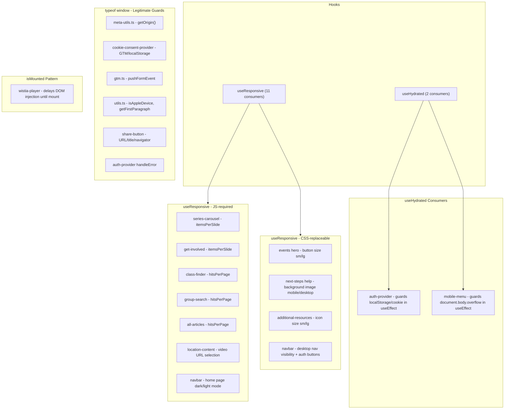

# Hydration Stabilization Refactor Plan

## Full Audit Summary

### Inventory of all hydration-sensitive patterns



---

## Phase 1: Remove redundant `useHydrated` guards (Lowest Risk)

**Rationale:** `useEffect` only runs on the client after hydration. Guarding browser API calls inside `useEffect` with `isHydrated` is double-guarding and adds unnecessary complexity + an extra render cycle.

### 1a. [app/providers/auth-provider/index.tsx](app/providers/auth-provider/index.tsx)

- **Remove** the `useHydrated` import and `isHydrated` variable (lines 3, 91)
- **useEffect (line 93):** Remove the `if (!isHydrated) return;` guard. Change the dependency array from `[isHydrated]` to `[]`. The `useEffect` already only fires client-side; `localStorage` and `document.cookie` are safe to access inside it.
- **handleLogin (line 140):** Remove `if (!isHydrated) return;`. This function is only callable via user interaction, which inherently happens post-hydration.
- **handleError (line 69):** The `typeof window === "undefined"` guard is legitimate (called from non-effect contexts like `logout`) -- leave it.

### 1b. [app/components/navbar/mobile/mobile-menu.component.tsx](app/components/navbar/mobile/mobile-menu.component.tsx)

- **Remove** the `useHydrated` import and `isHydrated` variable (lines 4, 24)
- **useEffect (line 29):** Remove the `if (!isHydrated) return;` guard. Change dependency array from `[isOpen, isSearchOpen, isHydrated]` to `[isOpen, isSearchOpen]`. `document.body.style` is safe inside `useEffect`.

### 1c. Delete [app/hooks/use-hydrated.ts](app/hooks/use-hydrated.ts)

After the above changes, no consumers remain. Delete the file.

### Verification

- Run `pnpm lint` and confirm no import errors
- Test auth flow: login with email, login with SMS, logout -- confirm `localStorage`/cookie behavior unchanged
- Test mobile menu: open/close menu and search, confirm body scroll lock works
- Check browser console for hydration warnings on all pages

---

## Phase 2: Replace CSS-achievable `useResponsive` with Tailwind (Low Risk)

These patterns use `useResponsive` solely to change visual properties that CSS media queries handle natively, with zero hydration mismatch.

### 2a. [app/routes/events/event-single/partials/hero.partial.tsx](app/routes/events/event-single/partials/hero.partial.tsx)

Current: `size={isSmall || isMedium ? "md" : "lg"}` (line 45)

**Approach:** Render two Button instances with Tailwind visibility classes:

```tsx
<Button size="md" className="w-full md:w-auto lg:hidden">Register</Button>
<Button size="lg" className="w-full md:w-auto hidden lg:inline-flex">Register</Button>
```

Or, if the Button primitive supports responsive sizing via class names (e.g., height/padding), apply responsive Tailwind directly to a single Button instance. Evaluate which approach is cleaner.

Remove `useResponsive` import if no other usage in this file.

### 2b. [app/routes/next-steps/partials/help.partial.tsx](app/routes/next-steps/partials/help.partial.tsx)

Current: `backgroundImage: url(${isXSmall ? mobileBgImage : desktopBgImage})` (line 65-66)

**Approach:** Use a `<picture>` element or CSS custom properties with media queries:

```tsx
<div className="bg-cover bg-center bg-[image:var(--bg-mobile)] sm:bg-[image:var(--bg-desktop)]"
     style={{ '--bg-mobile': `url(${mobileBgImage})`, '--bg-desktop': `url(${desktopBgImage})` } as React.CSSProperties}>
```

Or render both as hidden/visible layers with Tailwind. Remove `useResponsive` import.

### 2c. [app/components/additional-resources/index.tsx](app/components/additional-resources/index.tsx)

Current: `size={isSmall ? "sm" : "lg"}` (line 59)

**Approach:** Same dual-render or responsive class strategy as 2a. If the icon component supports Tailwind sizing, apply `className="size-4 md:size-6"` directly. Remove `useResponsive` import.

### Verification

- Visual regression check at each Tailwind breakpoint (xs, sm, md, lg, xl)
- Confirm no layout flash on initial load (elements now render correctly on SSR)
- Check browser console for hydration warnings

---

## Phase 3: Refactor navbar responsive logic (Medium Risk)

The navbar is the most complex consumer. It uses `useResponsive` for three distinct purposes.

### 3a. Desktop nav visibility override (lines 269-277)

Current: `hidden lg:inline` class + inline `style={{ display: isSearchOpen ? "none" : isLarge ? "inline" : "none" }}`

The CSS class already handles the responsive part. The inline style only adds the search-open override. Refactor to:

```tsx
<div className={cn("hidden lg:inline", isSearchOpen && "!hidden")}>
```

This eliminates the `isLarge` JS check entirely. The `isSearchOpen` toggle is state-driven (not responsive), so it doesn't cause hydration divergence.

### 3b. Auth/button visibility when search is open (line 392)

Current: `{(!isSearchOpen || isXLarge) && ( ... )}`

This conditionally removes buttons from the DOM. Replace with CSS visibility:

```tsx
<div className={cn("flex gap-2", isSearchOpen && "hidden xl:flex")}>
```

This eliminates the `isXLarge` JS check.

### 3c. Home page dark/light mode (lines 42-48, 144-165)

Current: `isSmall ? "dark" : "light"` on the home page.

This is the most complex pattern -- it controls CSS class-driven theming. **Keep `useResponsive` for this specific logic.** The default SSR render (light mode) is correct for desktop and causes only a brief flash on mobile (light to dark), which is acceptable because the navbar overlays the hero with `bg-transparent`. A CSS-only approach would require significant restructuring of the navbar theme system.

After 3a and 3b, the navbar will only use `isSmall` (for theme mode) and `isMedium` (passed to MobileMenu for mode switching). Remove `isLarge` and `isXLarge` from the destructured values.

### Verification

- Test navbar at all breakpoints with search open and closed
- Test dropdown menus on desktop
- Test mobile menu open/close
- Verify home page navbar theme transitions (scroll, search, dropdowns)
- Check for hydration console warnings

---

## Phase 4: Evaluate carousel and data-fetching patterns (Low Risk, Minimal Changes)

These patterns genuinely require JS-based responsive logic and are **not candidates for CSS replacement**.

### 4a. Algolia `hitsPerPage` (3 files)

- [app/routes/class-finder/class-single/partials/upcoming-sections.partial.tsx](app/routes/class-finder/class-single/partials/upcoming-sections.partial.tsx)
- [app/routes/group-finder/partials/group-search.partial.tsx](app/routes/group-finder/partials/group-search.partial.tsx)
- [app/routes/articles/all-articles/partials/all-articles.partial.tsx](app/routes/articles/all-articles/partials/all-articles.partial.tsx)

**Decision: Keep as-is.** The `useResponsive` hook returns all-false during SSR, hitting the `default` case (5 or 12 hits). After hydration, the correct count applies and Algolia re-fetches. This is the correct behavior -- over-fetching slightly on first SSR render is acceptable, and there is no DOM/hydration mismatch since `Configure` is a non-visual component.

### 4b. Carousel `itemsPerSlide` (3 files)

- [app/routes/series-resources/partials/series-carousel.partial.tsx](app/routes/series-resources/partials/series-carousel.partial.tsx)
- [app/routes/locations/location-single/components/tabs-component/upcoming-events/get-involved.tsx](app/routes/locations/location-single/components/tabs-component/upcoming-events/get-involved.tsx)
- [app/components/navbar/mobile/mobile-menu.component.tsx](app/components/navbar/mobile/mobile-menu.component.tsx) (`isMedium` for mode switching)

**Decision: Keep as-is.** Carousel slide counts are data-driven and cannot be expressed in CSS. The default (1 item per slide) is a safe SSR fallback. Consider long-term migration to CSS scroll-snap carousels, but that is a larger effort outside this scope.

### 4c. Location video selection

- [app/routes/locations/location-single/partials/location-content.tsx](app/routes/locations/location-single/partials/location-content.tsx)

**Decision: Keep as-is.** Different Wistia video IDs for mobile/desktop require JS. The fallback (desktop video) is reasonable for SSR.

### Verification

- Confirm carousels render correctly at all breakpoints
- Confirm Algolia result counts adjust after hydration
- No action items -- this phase is documentation/validation only

---

## Phase 5: Simplify Wistia player `isMounted` pattern (Low Risk)

### [app/primitives/video/wistia-player/index.tsx](app/primitives/video/wistia-player/index.tsx)

Current pattern: Two separate `useEffect` hooks, one to set `isMounted`, one gated on `isMounted`.

**Refactor:** Merge into a single `useEffect`:

```tsx
useEffect(() => {
  const script1 = document.createElement("script");
  // ... all DOM setup ...
  return () => {
    container.innerHTML = "";
  };
}, [videoId, wrapper]);
```

Keep the `isMounted` state only for the JSX conditional (`if (!isMounted && fallback)`), since that serves a valid purpose: rendering the fallback during SSR and hydration, then swapping to the player container after mount.

### Verification

- Test all pages with Wistia video embeds
- Verify videos load and play correctly
- Confirm fallback renders during SSR (view page source)

---

## Phase 6: Validate `typeof window` patterns (No Changes)

These are **legitimate** server-side safety guards, not hydration hacks. They do not cause render divergence.

| File                          | Pattern                              | Verdict                                                                  |
| ----------------------------- | ------------------------------------ | ------------------------------------------------------------------------ |
| `meta-utils.ts`               | `getOrigin()`                        | Runs in meta functions, never during render. Keep.                       |
| `cookie-consent-provider.tsx` | GTM + localStorage                   | Guards browser-only APIs. `hasConsent: null` on server is correct. Keep. |
| `gtm.ts`                      | `pushFormEvent`                      | Called from event handlers only. Keep.                                   |
| `utils.ts`                    | `isAppleDevice`, `getFirstParagraph` | Utility functions with server fallbacks. Keep.                           |
| `share-button.component.tsx`  | URL, title, navigator                | Provides SSR-safe defaults. Keep.                                        |
| `auth-provider handleError`   | `typeof window === "undefined"`      | Called from non-effect contexts. Keep.                                   |

### Verification

- Grep for any remaining `useHydrated` imports (should be zero)
- Run full test suite
- Run `pnpm lint`

---

## Post-Migration Cleanup

After all phases:

1. Confirm [app/hooks/use-hydrated.ts](app/hooks/use-hydrated.ts) is deleted
2. Confirm `useResponsive` is only imported where CSS cannot replace it (navbar theme, carousels, Algolia, location video)
3. Run full app smoke test across all routes at mobile, tablet, and desktop breakpoints
4. Monitor production for hydration warnings after deploy

---

## Risk Summary

| Phase                         | Risk     | Hydration Impact                                   | Files Changed         |
| ----------------------------- | -------- | -------------------------------------------------- | --------------------- |
| 1: Remove useHydrated         | Very Low | Eliminates unnecessary re-render cycle             | 3 files (+ 1 deleted) |
| 2: CSS-replace useResponsive  | Low      | Eliminates client/server divergence for 3 patterns | 3 files               |
| 3: Navbar responsive refactor | Medium   | Reduces JS-driven visibility to theme mode only    | 1 file                |
| 4: Carousel/data patterns     | None     | Validation only, no changes                        | 0 files               |
| 5: Wistia simplification      | Low      | Cleaner code, same behavior                        | 1 file                |
| 6: typeof window validation   | None     | Validation only, no changes                        | 0 files               |
